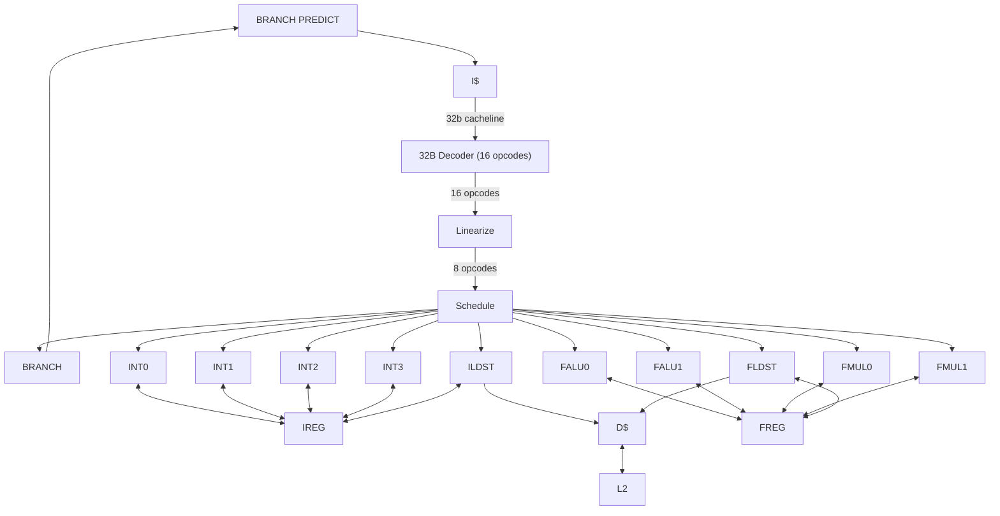

# GREYFOX Architecture

## Overview

The GREYFOX architcture is designed to be ...

## Block Diagram 

```mermaid
flowchart TD
    BRANCHP --> I$
    BRANCH --> BRANCHP[BRANCH PREDICT]

    A["32B Decoder (16 opcodes)"] -->|16 opcodes| Linearize
    Linearize --> |8 opcodes| Schedule
    Schedule --> BRANCH & INT0 & INT1 & INT2 & INT3 &  ILDST & FLDST & FALU0 & FALU1 & FMUL0 & FMUL1 
    INT0 & INT1 & INT2 & INT3 & ILDST <--> IREG
    ILDST & FLDST --> D$

    FALU0 & FALU1 & FMUL0 & FMUL1 & FLDST <--> FREG
    I$["I$"] --> |32b cacheline| A
    D$ <--> L2
```

